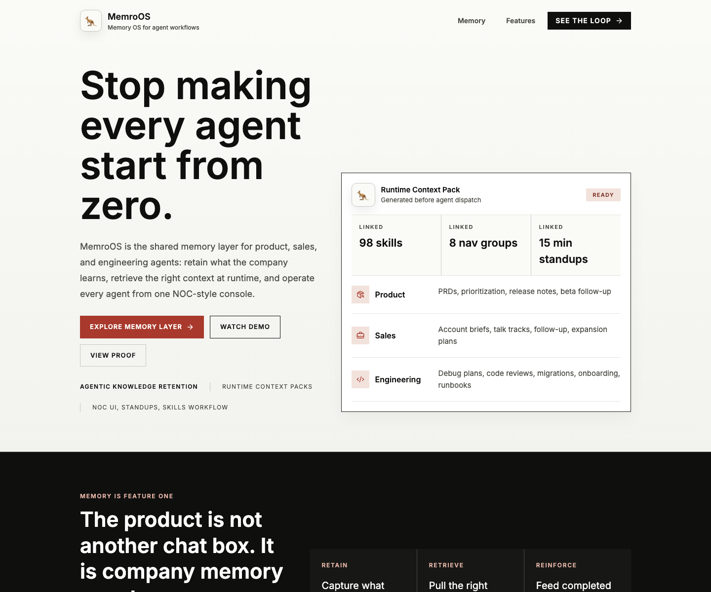
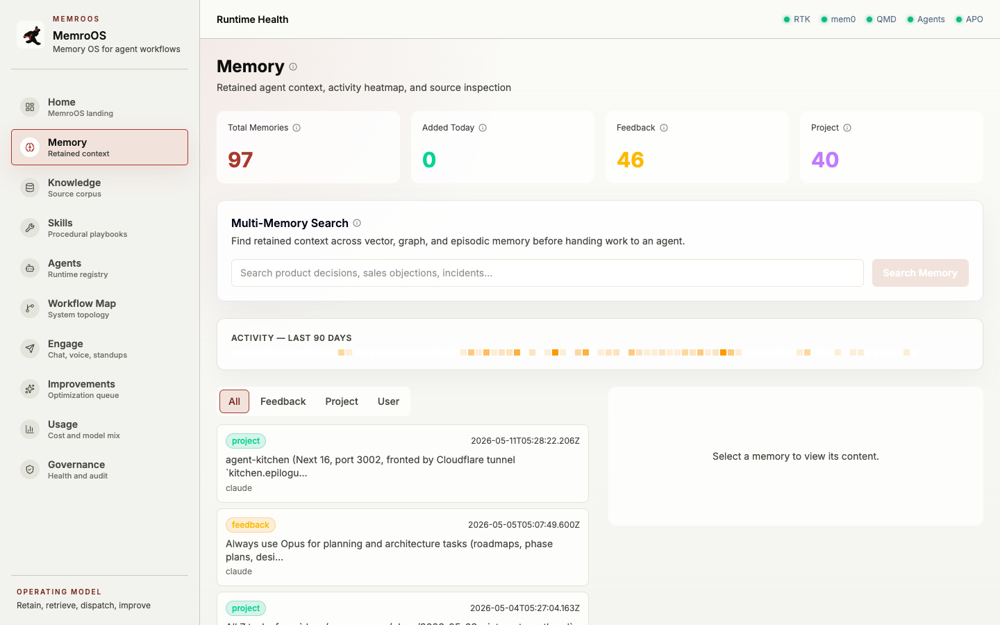
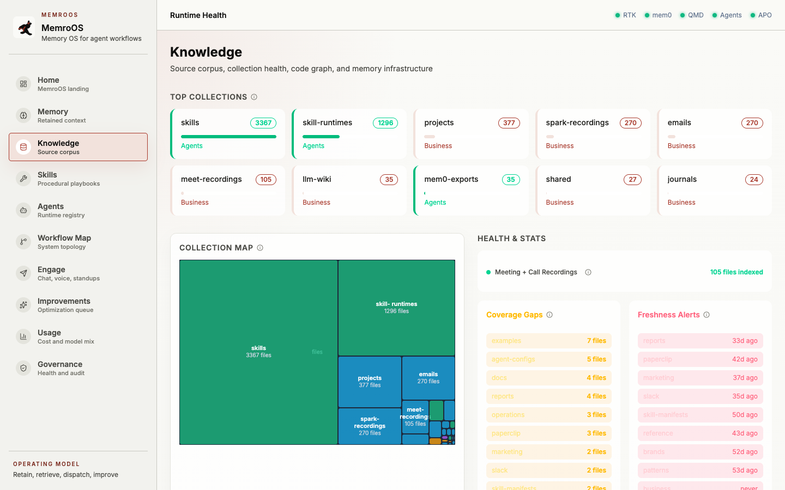
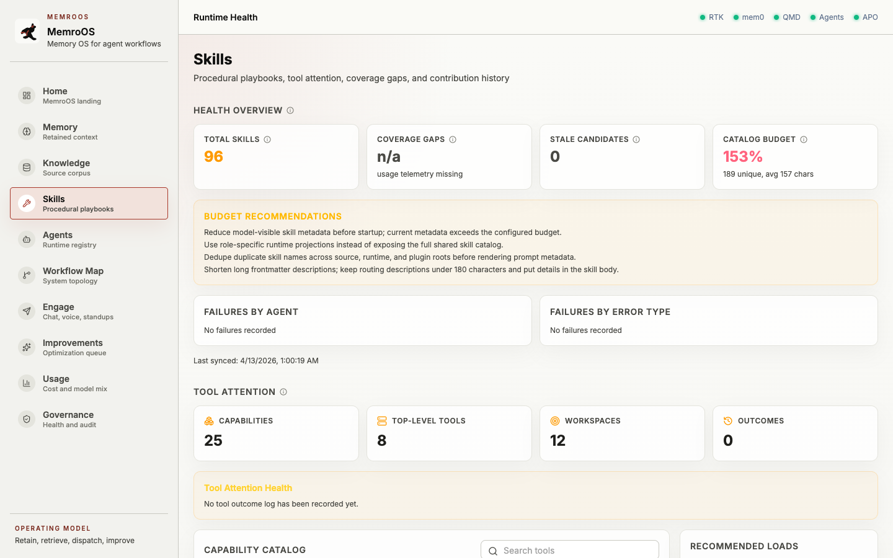
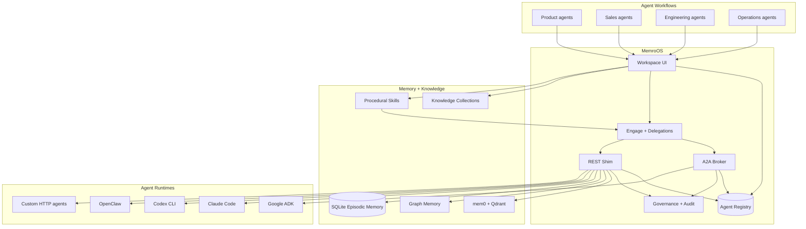
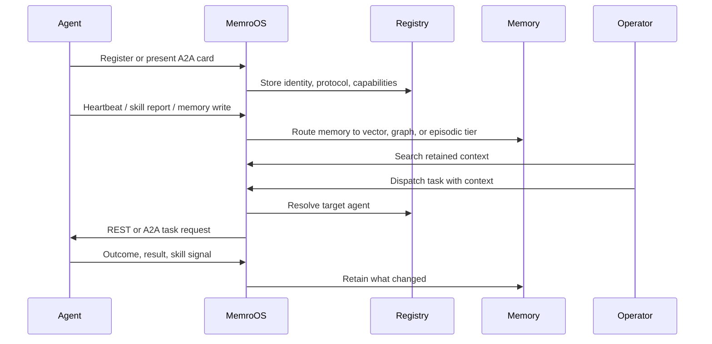
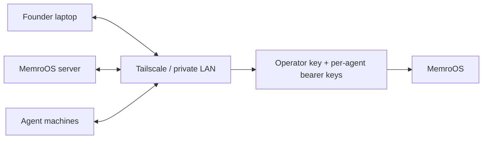
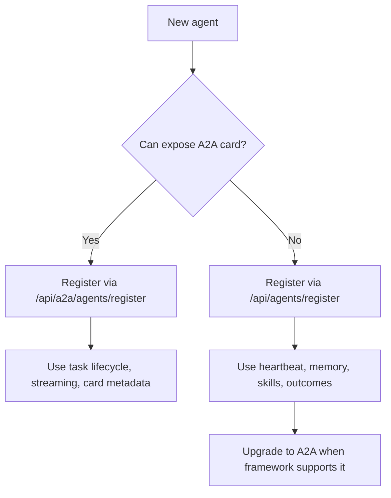
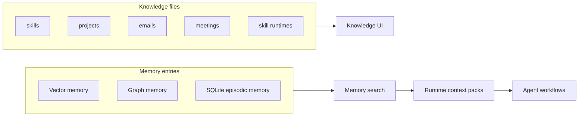

# MemroOS

<p align="center">
  <strong>Shared memory and governed orchestration for agent workflows.</strong>
</p>

<p align="center">
  MemroOS retains what product, sales, and engineering agents learn, retrieves the right context at runtime, and gives operators one NOC-style surface for memory, orchestration, skills, dispatch, evals, and trust.
</p>

<p align="center">
  <a href="https://memroos.com">memroos.com</a> ·
  <a href="#launch-quickstart">Launch Quickstart</a> ·
  <a href="#who-this-is-for">Who This Is For</a> ·
  <a href="#quickstart">Quickstart</a> ·
  <a href="#video-demo">Video Demo</a> ·
  <a href="#competitive-benchmark">Benchmark</a> ·
  <a href="#screenshots">Screenshots</a> ·
  <a href="#architecture">Architecture</a> ·
  <a href="#security-model">Security</a> ·
  <a href="#docs">Docs</a>
</p>

<p align="center">
  <a href="https://github.com/lac5q/memroos/blob/main/LICENSE"></a>
  
  
  
  
  
  
</p>

---

## Launch Quickstart

Try the memory loop in 5 minutes:

```bash
git clone https://github.com/lac5q/memroos.git
cd memroos
npm install
./setup.sh --wizard
./setup.sh
```

Then open `http://localhost:3000`, search retained memory, inspect Knowledge source health, register or dispatch an agent, and review the runtime context pack that gets assembled before work starts.

If you are evaluating the launch build, start with the v0.9.0 release, watch the demo, then open a workflow feedback issue with the first place your agents lose context. Maintainers can process launch feedback with the [workflow feedback intake guide](docs/workflow-feedback-intake.md).

## What MemroOS Is

Most agent systems remember too little, too late. Product decisions live in docs. Sales context lives in calls and CRM notes. Engineering knowledge lives in commits, incidents, and terminal history. Every new agent starts by rediscovering the same context.

MemroOS is the operating layer that gives agents a memory and governance plane:

- **Retain:** capture decisions, files, conversations, outcomes, and workflow history.
- **Retrieve:** assemble permission-aware context packs before an agent starts work.
- **Orchestrate:** pause, inspect, edit, resume, retry, and roll back long-running agent work with audit lineage.
- **Operate:** see memory health, model utility, live agents, governance, savings, and waste in one console.
- **Dispatch:** chat with agents, run group-room standups, and send work to local, REST, or A2A agents with source-backed context.
- **Prove:** connect agent output to the memories consumed, sources used, tools run, checks passed, and residual risks.
- **Improve:** review, edit, approve, and promote repeated successful workflows into durable governed skills and playbooks.

The repository began as `memroos.dev`; some internal package names, paths, and environment variables still use `memroos` for compatibility. The public product and positioning are now MemroOS.

## Competitive Benchmark

MemroOS now has a public-evidence benchmark for enterprise agentic memory and a passing live recall gate for the local target architecture.

Latest local results from May 24, 2026:

| Rank | Provider | Score | Note |
| ---: | --- | ---: | --- |
| 1 | MemRoOS competitive target | 84.06 | Governed multi-agent memory with hot-path recall, proof surfaces, and public evals. |
| 2 | MemRoOS current | 74.36 | Source-available memory/control plane with strong governance and workflow fit. |
| 3 | Letta | 70.58 | Strong stateful-agent memory platform. |
| 4 | Mem0 Platform | 70.44 | Strong memory engine baseline. |
| 5 | Zep | 68.64 | Strong temporal knowledge-graph memory. |

The benchmark compares public architecture evidence, governance depth, multi-agent workflow fit, retrieval design, interop, and proof surfaces. It does not claim private latency or accuracy for closed products without API access. See [the benchmark methodology and results](docs/marketplace/agentic-memory-benchmark-2026-05-24.md).

Live recall gate after target-architecture hardening:

- Full suite: `8/8` cases passed.
- Pass rate: `1.0`.
- p95 recall latency: `313 ms`.
- Tier failures: none.

## Video Demo

<p align="center">
  <video src="docs/demo/memroos-demo.mp4" controls muted playsinline width="900"></video>
</p>

<p align="center">
  <a href="docs/demo/memroos-demo.mp4">Watch the MemroOS demo video</a>
</p>

## Screenshots

<p align="center">
  
</p>

<p align="center">
  <em>The public landing page leads with retained agent knowledge, runtime context packs, and the new operator console that turns memory into daily agent operations.</em>
</p>

<table>
  <tr>
    <td width="50%"></td>
    <td width="50%"></td>
  </tr>
  <tr>
    <td><strong>Memory</strong><br>Search retained context across vector, graph, and episodic memory before handing work to an agent.</td>
    <td><strong>Knowledge</strong><br>Track source files, freshness, collections, and knowledge health for agent consumption.</td>
  </tr>
  <tr>
    <td width="50%"></td>
    <td width="50%"></td>
  </tr>
  <tr>
    <td><strong>Engage</strong><br>Dispatch tasks, chat with agent runtimes, run standups, and inspect live delegation state.</td>
    <td><strong>Skills</strong><br>Review, edit, approve, and promote reusable procedures from agent-local playbooks into enterprise-ready workflows.</td>
  </tr>
</table>

## Why This Exists

Native AI companies are moving from one-off prompt demos to agent workflows that touch roadmap, revenue, code, support, operations, and internal tools. The hard problem is no longer "can an agent answer?" It is:

- What does the agent already know?
- Where did that knowledge come from?
- Which memory did it consume before acting?
- Which framework, agent card, MCP server, or local worker is actually doing the work?
- Who can pause, edit, resume, retry, or roll back a run?
- What should be retained from the outcome?
- When should repeated work become a skill?
- What proof shows the work was checked?
- Which agent is allowed to do what?

MemroOS is built for that layer.

## Who This Is For

- **AI-native founders and operators** who run agents across product, sales, engineering, support, and internal operations.
- **Agent framework users** working with Claude Code, Codex, Google ADK, LangGraph, CrewAI, AutoGen, Hermes, OpenClaw, or custom runtimes that need retained context beside the framework.
- **Product and engineering leaders** who want source-backed runtime context packs before dispatch and proof trails after execution.
- **Self-hosted and local-first builders** who want memory, knowledge, orchestration, skills, agents, usage, and governance in one inspectable repo.

MemroOS is not another agent framework. It is the context plane before dispatch and the proof trail after execution.

## Primary Use Cases

### Product

Retain customer interviews, launch notes, roadmap decisions, objections, and beta learnings. Retrieve them into PRDs, prioritization work, release notes, and follow-up workflows.

### Sales

Retain CRM notes, call takeaways, buyer preferences, competitor mentions, and account history. Retrieve them into account briefs, talk tracks, follow-up, and expansion plans.

### Engineering

Retain architecture decisions, incidents, deploy fixes, repo patterns, and code review outcomes. Retrieve them into debug plans, migrations, reviews, onboarding, and runbooks.

## What To Try First

After setup, you can:

1. Open the MemroOS workspace.
2. Search retained memory across product, sales, engineering, and operational context.
3. Inspect source corpus health in the Knowledge view.
4. Register a local, REST, or A2A-compatible agent.
5. Dispatch work and inspect live delegation state.
6. Run a 15-minute group-room standup or direct agent chat from the Engage surface.
7. Review skill proposals before they modify instructions or playbooks.
8. Keep memory, knowledge, orchestration, skills, agents, usage, and governance in one operator surface.

## Release 0.9

`v0.9.0` is the public documentation release for MemroOS's memory-plus-governance positioning.

The current release includes:

- A new NOC-style operator console with grouped navigation, dense operational metrics, and a consistent public-to-product visual system.
- A Next.js workspace with Memory, Knowledge, Skills, Agents, Workflow Map, Engage, Improvements, Usage, and Governance surfaces.
- A Skills workflow for reviewing, editing, approving, and promoting procedures from agent-local playbooks into enterprise-ready workflows.
- A task-first Dispatch room with direct chat, group-room standups, voice prompt controls, and inspectable participant context.
- A canonical SQLite-backed agent registry for REST, UI, and A2A-visible agents.
- A2A card ingestion, task routes, streaming subscription endpoints, and Google ADK compatibility fixtures.
- REST reporting endpoints for heartbeats, memory writes, skill reports, and tool outcomes.
- Memory and knowledge visibility across configured file collections, mem0/Qdrant, graph memory, and local SQLite.
- Human-gated Agent Lightning/APO approvals so self-learning proposals queue before mutating agent instructions.

## Completed Roadmap

- **Phase 41: Public Polish** - public README, contribution guide, security policy, issue templates, and GitHub Actions checks for public collaboration.
- **Phases 42-45: v2.1 Security + Trust Layer** - Iris dispatch preflight, prompt-injection checks, tool-permission governance, security reporting, and progressive capability exposure.
- **Phases 46-49: v2.2 LLM Optimization + Evaluation** - model-routing telemetry, recommendation surfaces, evaluation fixtures, optimization dashboards, and quality reports.
- **Phases 50-52: v2.3 Agent Runtime Enhancements** - runtime middleware, memory client v2 paths, richer engagement state, and observability surfaces for live agents.
- **Phases 53-54: v2.4 Performance + Caching** - response caching, query-path tuning, and faster memory/knowledge retrieval for operator workflows.
- **UI migration: Memory OS operator surface** - NOC-style home, 8-group navigation, Workflow Map, full authenticated page reskin, task-first Dispatch, and a first-class Skills workflow.

## Current Roadmap Focus

The active GSD milestone is `v5.2: Competitive Memory Target Architecture`. It keeps the product focused on measurable memory advantage instead of generic agent breadth:

- **Phase 84: Competitive memory target architecture** - complete locally. The marketplace benchmark ranks the target architecture first, and the live recall suite passes 8/8 after vector write hardening.
- **Next focus: hot-path retrieval** - make the benchmark advantage visible in day-to-day runtime latency, cache prewarm, and context-pack assembly.
- **Next focus: temporal invalidation** - close the remaining Zep-style temporal memory gap without weakening MemRoOS governance, audit, or source proof.
- **Next focus: public benchmark proof** - keep the methodology, fixtures, and results reproducible so public claims stay defensible.

## What MemroOS Does

- **Memory search:** Search retained context before an agent starts work.
- **Governed orchestration:** Edit paused HIL state, retry and roll back multi-hop runs, and keep audit lineage for operator decisions.
- **Operations NOC:** Watch memory consumption, undigested work, agent workload, model utility, governance, savings, and waste from the first screen.
- **Knowledge corpus:** Track files, freshness, collections, and source health.
- **Evidence loop:** Connect outputs to sources, memories, tool actions, checks, assumptions, risks, and replay or rollback handles as the roadmap lands.
- **Skill workflow:** Review, edit, approve, and promote repeatable procedures into governed skills with contract fields.
- **Agent registry:** Maintain one canonical roster for local, REST, UI, and A2A agents.
- **A2A broker:** Expose agent cards, JSON-RPC endpoints, task lifecycle routes, SSE task updates, and outbound A2A delegation.
- **MCP-facing context:** Keep memory, knowledge, and skills behind a shared context surface instead of scattering direct tool access across every agent.
- **REST shim:** Let agents report heartbeats, memories, skills, and outcomes before they speak A2A.
- **Task-first dispatch:** Run direct chat, group-room standups, live delegations, and spoken prompts with inspectable context.
- **Workflow map:** Visualize agents, memory, skills, dispatch paths, and infrastructure.
- **Governance:** Gate registry writes, memory reads, destructive actions, and self-learning approvals.

## What MemroOS Is Not

- Not a replacement for Claude Code, Codex, OpenClaw, Hermes, Google ADK, LangGraph, CrewAI, or AutoGen.
- Not a voice bot company. Voice is one ingestion path for organizational memory.
- Not a search-admin UI. qmd freshness work exists to prove context is current before agents act.
- Not a hosted SaaS control plane in this repo.
- Not an excuse to expose private agents directly to the public internet.
- Not finished. It is useful, inspectable, hackable, and moving quickly.

## Architecture

MemroOS is intentionally thin at the boundary and durable at the center.



### Memory Loop



## Quickstart

### Prerequisites

- Node.js and npm
- Python 3
- Docker with Docker Compose
- Optional: Qdrant Cloud URL and API key for vector memory
- Optional: Tailscale for multi-machine private networking

```bash
git clone https://github.com/lac5q/memroos.git
cd memroos
npm install
./setup.sh --wizard
./setup.sh
```

On macOS, `setup.sh` also installs the Memory Resilience monitors by default:

- `com.memroos.memory-healthcheck`: every 5 minutes, checks mem0, QMD, queued writes, Gmail context freshness, source-to-QMD indexing for recent knowledge artifacts, and embedding round-trip health.
- `com.memroos.memory-degradation-evals`: daily at 9:15 AM, runs the degradation regression suite.

Set `INSTALL_MEMORY_RESILIENCE=0` before `./setup.sh` to skip launchd monitor installation, or run `npm run install:memory-resilience` later.

To verify that Google Drive exports, meeting recordings, Spark notes, emails, Slack source files, and analysis files are actually agent-searchable, not merely present on disk:

```bash
npm run check:knowledge-indexing -- --days=2
```

Open MemroOS:

```text
http://localhost:3000
```

For a local production-style server:

```bash
npm --prefix apps/memroos run build
MEMROOS_PUBLIC_BASE_URL=http://localhost:3002 \
MEMROOS_A2A_ENDPOINT_BASE_URL=http://localhost:3002 \
npm --prefix apps/memroos run start -- --port 3002
```

The environment variable prefix is still `MEMROOS_*` for compatibility with existing installs.

## Recommended Deployment

MemroOS is designed to start private and become public only when you mean it.



Operating profiles:

- `local-dev`: one developer machine; loopback registry writes can work without an operator key.
- `single-host`: all services on one server or VM; operator key required.
- `private-network`: recommended startup deployment for multiple machines on Tailscale or LAN.
- `cloud-https`: internet-reachable deployment behind HTTPS reverse proxy or tunnel.
- `custom`: operator-defined topology with explicit environment values.

See [Install profiles](docs/install-profiles.md).

## Agent Registry

MemroOS has one canonical registry. The `/agents` page shows the DB-backed roster, not ad hoc files.

### Register a REST agent

```bash
curl -X POST http://localhost:3000/api/agents/register \
  -H 'Content-Type: application/json' \
  -H 'x-memroos-operator-key: <operator-key>' \
  -d '{
    "id": "worker-1",
    "name": "Worker 1",
    "role": "Research and implementation agent",
    "platform": "codex",
    "protocol": "rest",
    "location": "tailscale",
    "host": "agent.tailnet",
    "port": 8787,
    "healthEndpoint": "/health"
  }'
```

### Register an A2A agent by card URL

```bash
curl -X POST http://localhost:3000/api/a2a/agents/register \
  -H 'Content-Type: application/json' \
  -H 'x-memroos-operator-key: <operator-key>' \
  -d '{
    "cardUrl": "http://agent.tailnet:8000/.well-known/agent-card.json",
    "source": "a2a"
  }'
```

The response may include an API key unless `issueApiKey` is false. Store it securely. MemroOS never displays stored bearer tokens after creation.

### One-command agent onboarding

For agents that can run shell commands, create a short-lived invite and hand the returned command to the agent. The invite registers the agent, mints its per-agent API key, and returns a MemroOS MCP config.

```bash
curl -X POST http://localhost:3000/api/onboarding/invite \
  -H 'Content-Type: application/json' \
  -H 'x-memroos-operator-key: <operator-key>' \
  -d '{
    "agentId": "maria",
    "name": "Maria",
    "role": "Research and implementation partner",
    "platform": "openclaw",
    "ttlMinutes": 15
  }'
```

Give the `command` from the response to the agent. The command looks like:

```bash
curl -fsSL 'https://memroos.example/api/onboarding/script?token=...' | bash -s -- --id 'maria' --name 'Maria' --role 'Research and implementation partner' --platform 'openclaw' --mcp-target 'auto'
```

The default `--mcp-target auto` selects the right installer from the platform: `hermes`, `openclaw`, `claude`, `gemini`, `qwen`, `codex`, or `stdout` for ChatGPT. ChatGPT cannot run the shell command directly; for ChatGPT, use the returned `mcpUrl` as the custom connector URL in ChatGPT Apps & Connectors.

## Add MemroOS To Agent Clients

### ChatGPT

ChatGPT uses remote MCP over HTTP. Start the MCP facade and expose it through a trusted HTTPS URL such as Tailscale Funnel, Cloudflare Tunnel, or your own private gateway:

```bash
cd /path/to/memroos
MEMROOS_MCP_PUBLIC_BASE_URL=https://memroos.example npm run install:mcp:chatgpt
```

The connector URL is:

```text
https://memroos.example/mcp
```

In ChatGPT, open **Settings -> Connectors -> Advanced -> Developer mode**, add a remote MCP server, name it `MemroOS`, and use the `/mcp` URL above.

### Claude Desktop

Claude Desktop can run MemroOS locally over stdio. Edit:

```text
~/Library/Application Support/Claude/claude_desktop_config.json
```

Add or merge this server entry:

```json
{
  "mcpServers": {
    "memroos": {
      "command": "/bin/bash",
      "args": [
        "-lc",
        "exec \"${MEMROOS_ROOT:-$HOME/github/memroos}/scripts/memroos-mcp.sh\""
      ]
    }
  }
}
```

Fully quit and reopen Claude Desktop after saving the file. If your local clone is somewhere else, either set `MEMROOS_ROOT` or replace `$HOME/github/memroos` with the absolute path to this repo.

## Protocol Strategy



Use **A2A** when the framework can expose or consume an agent card and task lifecycle. Use the **REST shim** when the framework does not speak A2A yet or when you only need reporting: heartbeat, memory writes, skill outcomes, and registry visibility.

## Memory And Knowledge

MemroOS keeps source knowledge and retained memory separate on purpose.



Knowledge files are counted from configured collections. Memory entries live in separate memory services and SQLite tables, so a collection file count is not the same thing as total memories.

## Progressive Capabilities

MemroOS treats specialized systems as optional progressive capabilities. They can be checked during setup, shown in tool-attention, and recommended from outcome history without becoming required dependencies for every install.

Enable the current optional bundle with:

```env
MEMROOS_OPTIONAL_CAPABILITIES=gitnexus,agent-lightning
```

Current bundled capabilities:

- **GitNexus:** Code graph and impact analysis capability. MemroOS catalogs the capability, reports status, and helps agents decide when to load it.
- **Agent Lightning/APO:** Human-gated self-learning proposal workflow. MemroOS owns the operator UI/API approval queue while worker CLIs apply approved proposals.

## Security Model

MemroOS is built for private-network production first.

- Registry writes require `MEMROOS_OPERATOR_API_KEY` outside local loopback.
- Agent write/reporting endpoints require per-agent bearer credentials minted by the registry.
- Memory read endpoints require operator authorization because they can expose sensitive context.
- Prefer Tailscale or a private LAN for multi-machine startup deployments.
- Use HTTPS and explicit operator keys for public or tunnel exposure.
- Treat agent cards as untrusted input. MemroOS validates URL policy, payload size, required fields, and registration authorization.

## Local URLs

- Landing page: `http://localhost:3000`
- Production-style local server: `http://localhost:3002`
- Memory UI: `/notebooks`
- Knowledge UI: `/library`
- Skills UI: `/cookbooks`
- Agent registry: `/agents`
- Engage / Dispatch UI: `/dispatch`
- Workflow Map UI: `/flow`
- A2A card: `/.well-known/agent-card.json`

## Development

```bash
npm run dev
npm run test
npm run lint
npm run build
npm run profiles:check
npm run first-run:check
npm run eval:memory-degradation
```

## Project Structure

```text
memroos/
├── apps/memroos/              # Next.js UI and API routes
├── services/orchestration/    # Python LangGraph orchestration service
├── services/memory/           # mem0 service wrapper
├── services/knowledge-mcp/    # Knowledge/tool-attention MCP facade
├── services/voice-server/     # Optional voice service
├── config/                    # Operating profiles
├── docker/                    # Service Dockerfiles
├── docs/                      # User and architecture docs
├── scripts/                   # Setup and validation scripts
└── data/                      # Local SQLite state, gitignored
```

## Docs

- [Architecture](docs/architecture.md)
- [Install profiles](docs/install-profiles.md)
- [REST API reference](docs/rest-api.md)
- [Memory architecture](docs/memory-architecture.md)
- [Agentic memory benchmark](docs/marketplace/agentic-memory-benchmark-2026-05-24.md)
- [Claude Code integration](docs/integrations/claude-code.md)
- [Google ADK integration](docs/integrations/google-adk.md)
- [LangGraph integration](docs/integrations/langgraph.md)
- [MemroOS MCP server](docs/integrations/mcp.md)
- [CrewAI and AutoGen integration](docs/integrations/crewai-autogen.md)
- [Workflow feedback intake](docs/workflow-feedback-intake.md)

## Roadmap

Near-term focus:

- Finish Phase 70: multi-hop retry/rollback and auth-guarded HIL edit-and-continue UI.
- Add semantic/hybrid recall and HIL SLA countdown/escalation without replacing qmd BM25 or mem0/Qdrant memory.
- Treat voice as a memory-ingestion surface with consent and token-safety controls.
- Add cross-project recall with explicit allowed project IDs.
- Make evidence bundles visible: memories consumed, tools/commands run, checks passed, unverified assumptions, residual risks, and replay/rollback artifacts.
- Normalize cross-harness skills into governed contracts with preconditions, allowed tools, risk tier, verification checks, owner, rollback behavior, and dispatch status.

## Contributing

This project is early, but useful contributions are welcome.

Start with [CONTRIBUTING.md](CONTRIBUTING.md) for setup, branch, pull request, and verification expectations. Please also read [SECURITY.md](SECURITY.md) before reporting security issues or sharing logs from agent runs.

Good first contribution areas:

- Add an adapter for an agent framework you use.
- Improve setup docs for your deployment shape.
- Add A2A compatibility fixtures.
- Improve memory search and source attribution.
- Improve security tests around registry writes and memory reads.

If MemroOS helps you stop making every agent start from zero, please star the repo. It helps the project find people building the same useful future.

## License

MemroOS is distributed under the [PolyForm Small Business License 1.0.0](LICENSE). Small businesses that meet the license thresholds may use it under those terms. Larger commercial use requires a separate commercial license. See [COMMERCIAL-LICENSE.md](COMMERCIAL-LICENSE.md).

Memroos versions up to the `memroos-mit-final` tag were distributed under the MIT License. Those earlier MIT rights remain governed by those earlier terms. The current license applies to MemroOS copies and contributions after the license-change commit.
