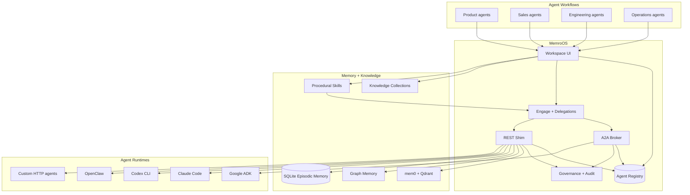
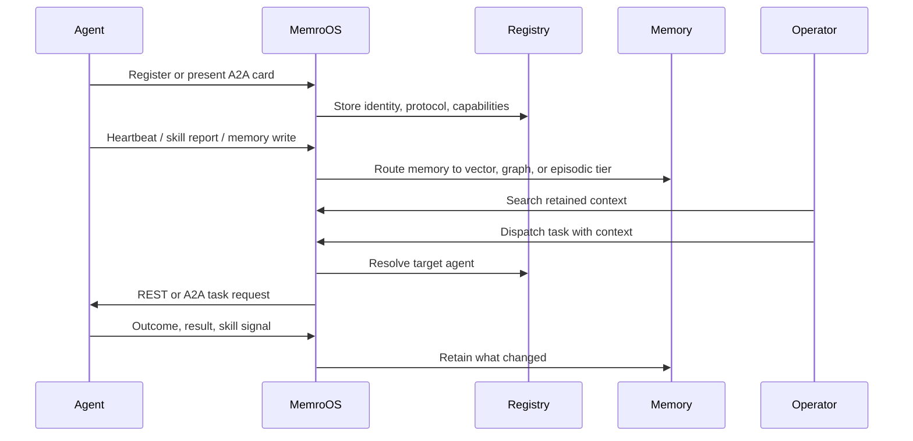
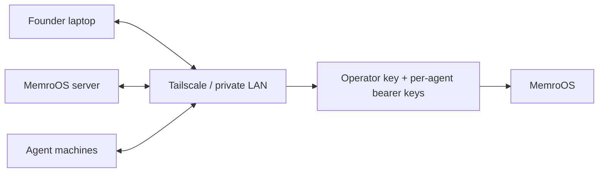
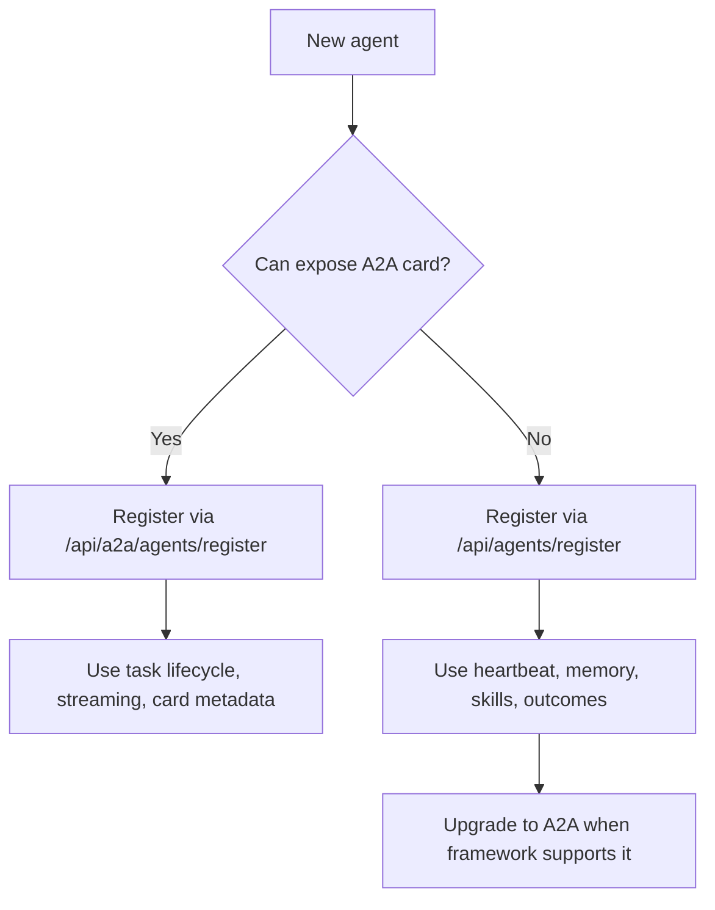
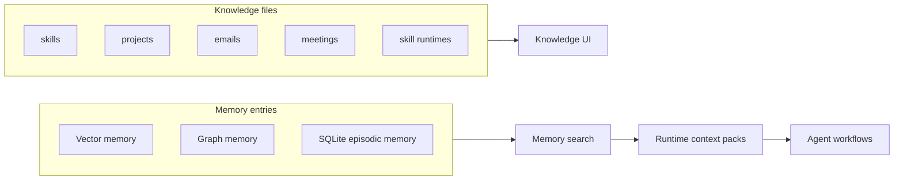

# MemroOS

<p align="center">
  <strong>Memory OS for agent workflows.</strong>
</p>

<p align="center">
  MemroOS retains what product, sales, and engineering agents learn, retrieves the right context at runtime, and turns repeated work into durable skills.
</p>

<p align="center">
  <a href="https://memroos.com">memroos.com</a> ·
  <a href="#quickstart">Quickstart</a> ·
  <a href="#screenshots">Screenshots</a> ·
  <a href="#architecture">Architecture</a> ·
  <a href="#security-model">Security</a> ·
  <a href="#docs">Docs</a>
</p>

<p align="center">
  <a href="https://github.com/lac5q/agentkitchen.dev/blob/main/LICENSE"></a>
  
  
  
  
  
</p>

---

## What MemroOS Is

Most agent systems remember too little, too late. Product decisions live in docs. Sales context lives in calls and CRM notes. Engineering knowledge lives in commits, incidents, and terminal history. Every new agent starts by rediscovering the same context.

MemroOS is the operating layer that gives agents a memory plane:

- **Retain:** capture decisions, files, conversations, outcomes, and workflow history.
- **Retrieve:** assemble permission-aware context packs before an agent starts work.
- **Dispatch:** send work to local, REST, or A2A agents with source-backed context.
- **Improve:** promote repeated successful workflows into durable skills and playbooks.

The repository began as `agentkitchen.dev`; some internal package names, paths, and environment variables still use `kitchen` for compatibility. The public product and positioning are now MemroOS.

## Screenshots

<p align="center">
  
</p>

<p align="center">
  <em>The public landing page leads with retained agent knowledge, runtime context packs, and product/sales/engineering workflows.</em>
</p>

<table>
  <tr>
    <td width="50%"></td>
    <td width="50%"></td>
  </tr>
  <tr>
    <td><strong>Memory</strong><br>Search retained context across vector, graph, and episodic memory before handing work to an agent.</td>
    <td><strong>Knowledge</strong><br>Track source files, freshness, collections, and knowledge health for agent consumption.</td>
  </tr>
  <tr>
    <td width="50%"></td>
    <td width="50%"></td>
  </tr>
  <tr>
    <td><strong>Engage</strong><br>Dispatch tasks, chat with agent runtimes, and inspect live delegation state.</td>
    <td><strong>Skills</strong><br>See which repeated workflows are becoming reusable procedural playbooks.</td>
  </tr>
</table>

## Why This Exists

Native AI companies are moving from one-off prompt demos to agent workflows that touch roadmap, revenue, code, support, operations, and internal tools. The hard problem is no longer "can an agent answer?" It is:

- What does the agent already know?
- Where did that knowledge come from?
- Which memory did it consume before acting?
- What should be retained from the outcome?
- When should repeated work become a skill?
- Which agent is allowed to do what?

MemroOS is built for that layer.

## Primary Use Cases

### Product

Retain customer interviews, launch notes, roadmap decisions, objections, and beta learnings. Retrieve them into PRDs, prioritization work, release notes, and follow-up workflows.

### Sales

Retain CRM notes, call takeaways, buyer preferences, competitor mentions, and account history. Retrieve them into account briefs, talk tracks, follow-up, and expansion plans.

### Engineering

Retain architecture decisions, incidents, deploy fixes, repo patterns, and code review outcomes. Retrieve them into debug plans, migrations, reviews, onboarding, and runbooks.

## What You Can Do In 5 Minutes

After setup, you can:

1. Open the MemroOS workspace.
2. Search retained memory across product, sales, engineering, and operational context.
3. Inspect source corpus health in the Knowledge view.
4. Register a local, REST, or A2A-compatible agent.
5. Dispatch work and inspect live delegation state.
6. Review skill proposals before they modify instructions or playbooks.
7. Keep memory, knowledge, skills, agents, usage, and governance in one operator surface.

## Release 0.1

`v0.1.0` is the first public operator preview of MemroOS.

The current release includes:

- A Next.js workspace with Memory, Knowledge, Skills, Agents, Workflow Map, Engage, Improvements, Usage, and Governance surfaces.
- A canonical SQLite-backed agent registry for REST, UI, and A2A-visible agents.
- A2A card ingestion, task routes, streaming subscription endpoints, and Google ADK compatibility fixtures.
- REST reporting endpoints for heartbeats, memory writes, skill reports, and tool outcomes.
- Memory and knowledge visibility across configured file collections, mem0/Qdrant, graph memory, and local SQLite.
- Human-gated Agent Lightning/APO approvals so self-learning proposals queue before mutating agent instructions.

## What MemroOS Does

- **Memory search:** Search retained context before an agent starts work.
- **Knowledge corpus:** Track files, freshness, collections, and source health.
- **Skill analytics:** Watch repeatable workflows become procedural playbooks.
- **Agent registry:** Maintain one canonical roster for local, REST, UI, and A2A agents.
- **A2A broker:** Expose agent cards, JSON-RPC endpoints, task lifecycle routes, SSE task updates, and outbound A2A delegation.
- **REST shim:** Let agents report heartbeats, memories, skills, and outcomes before they speak A2A.
- **Workflow map:** Visualize agents, memory, skills, dispatch paths, and infrastructure.
- **Governance:** Gate registry writes, memory reads, destructive actions, and self-learning approvals.

## What MemroOS Is Not

- Not a replacement for Claude Code, Codex, OpenClaw, Hermes, Google ADK, LangGraph, CrewAI, or AutoGen.
- Not a hosted SaaS control plane in this repo.
- Not an excuse to expose private agents directly to the public internet.
- Not finished. It is useful, inspectable, hackable, and moving quickly.

## Architecture

MemroOS is intentionally thin at the boundary and durable at the center.



### Memory Loop



## Quickstart

### Prerequisites

- Node.js and npm
- Python 3
- Docker with Docker Compose
- Optional: Qdrant Cloud URL and API key for vector memory
- Optional: Tailscale for multi-machine private networking

```bash
git clone https://github.com/lac5q/agentkitchen.dev.git
cd agentkitchen.dev
npm install
./setup.sh --wizard
./setup.sh
```

Open MemroOS:

```text
http://localhost:3000
```

For a local production-style server:

```bash
npm --prefix apps/kitchen run build
KITCHEN_PUBLIC_BASE_URL=http://localhost:3002 \
KITCHEN_A2A_ENDPOINT_BASE_URL=http://localhost:3002 \
npm --prefix apps/kitchen run start -- --port 3002
```

The environment variable prefix is still `KITCHEN_*` for compatibility with existing installs.

## Recommended Deployment

MemroOS is designed to start private and become public only when you mean it.



Operating profiles:

- `local-dev`: one developer machine; loopback registry writes can work without an operator key.
- `single-host`: all services on one server or VM; operator key required.
- `private-network`: recommended startup deployment for multiple machines on Tailscale or LAN.
- `cloud-https`: internet-reachable deployment behind HTTPS reverse proxy or tunnel.
- `custom`: operator-defined topology with explicit environment values.

See [Install profiles](docs/install-profiles.md).

## Agent Registry

MemroOS has one canonical registry. The `/agents` page shows the DB-backed roster, not ad hoc files.

### Register a REST agent

```bash
curl -X POST http://localhost:3000/api/agents/register \
  -H 'Content-Type: application/json' \
  -H 'x-kitchen-operator-key: <operator-key>' \
  -d '{
    "id": "worker-1",
    "name": "Worker 1",
    "role": "Research and implementation agent",
    "platform": "codex",
    "protocol": "rest",
    "location": "tailscale",
    "host": "agent.tailnet",
    "port": 8787,
    "healthEndpoint": "/health"
  }'
```

### Register an A2A agent by card URL

```bash
curl -X POST http://localhost:3000/api/a2a/agents/register \
  -H 'Content-Type: application/json' \
  -H 'x-kitchen-operator-key: <operator-key>' \
  -d '{
    "cardUrl": "http://agent.tailnet:8000/.well-known/agent-card.json",
    "source": "a2a"
  }'
```

The response may include an API key unless `issueApiKey` is false. Store it securely. MemroOS never displays stored bearer tokens after creation.

### One-command agent onboarding

For agents that can run shell commands, create a short-lived invite and hand the returned command to the agent. The invite registers the agent, mints its per-agent API key, and returns a MemroOS MCP config.

```bash
curl -X POST http://localhost:3000/api/onboarding/invite \
  -H 'Content-Type: application/json' \
  -H 'x-kitchen-operator-key: <operator-key>' \
  -d '{
    "agentId": "maria",
    "name": "Maria",
    "role": "Research and implementation partner",
    "platform": "openclaw",
    "ttlMinutes": 15
  }'
```

Give the `command` from the response to the agent. The command looks like:

```bash
curl -fsSL 'https://memroos.example/api/onboarding/script?token=...' | bash -s -- --id 'maria' --name 'Maria' --role 'Research and implementation partner' --platform 'openclaw' --mcp-target 'auto'
```

The default `--mcp-target auto` selects the right installer from the platform: `hermes`, `openclaw`, `claude`, `gemini`, `qwen`, `codex`, or `stdout` for ChatGPT. ChatGPT cannot run the shell command directly; for ChatGPT, use the returned `mcpUrl` as the custom connector URL in ChatGPT Apps & Connectors.

## Add MemroOS To Agent Clients

### ChatGPT

ChatGPT uses remote MCP over HTTP. Start the MCP facade and expose it through a trusted HTTPS URL such as Tailscale Funnel, Cloudflare Tunnel, or your own private gateway:

```bash
cd /path/to/agentkitchen.dev
KITCHEN_MCP_PUBLIC_BASE_URL=https://memroos.example npm run install:mcp:chatgpt
```

The connector URL is:

```text
https://memroos.example/mcp
```

In ChatGPT, open **Settings -> Connectors -> Advanced -> Developer mode**, add a remote MCP server, name it `MemroOS`, and use the `/mcp` URL above.

### Claude Desktop

Claude Desktop can run MemroOS locally over stdio. Edit:

```text
~/Library/Application Support/Claude/claude_desktop_config.json
```

Add or merge this server entry:

```json
{
  "mcpServers": {
    "memroos": {
      "command": "/bin/bash",
      "args": [
        "-lc",
        "exec \"${AGENT_KITCHEN_ROOT:-$HOME/github/agentkitchen.dev}/scripts/agentkitchen-mcp.sh\""
      ]
    }
  }
}
```

Fully quit and reopen Claude Desktop after saving the file. If your local clone is somewhere else, either set `AGENT_KITCHEN_ROOT` or replace `$HOME/github/agentkitchen.dev` with the absolute path to this repo.

## Protocol Strategy



Use **A2A** when the framework can expose or consume an agent card and task lifecycle. Use the **REST shim** when the framework does not speak A2A yet or when you only need reporting: heartbeat, memory writes, skill outcomes, and registry visibility.

## Memory And Knowledge

MemroOS keeps source knowledge and retained memory separate on purpose.



Knowledge files are counted from configured collections. Memory entries live in separate memory services and SQLite tables, so a collection file count is not the same thing as total memories.

## Progressive Capabilities

MemroOS treats specialized systems as optional progressive capabilities. They can be checked during setup, shown in tool-attention, and recommended from outcome history without becoming required dependencies for every install.

Enable the current optional bundle with:

```env
KITCHEN_OPTIONAL_CAPABILITIES=gitnexus,agent-lightning
```

Current bundled capabilities:

- **GitNexus:** Code graph and impact analysis capability. MemroOS catalogs the capability, reports status, and helps agents decide when to load it.
- **Agent Lightning/APO:** Human-gated self-learning proposal workflow. MemroOS owns the operator UI/API approval queue while worker CLIs apply approved proposals.

## Security Model

MemroOS is built for private-network production first.

- Registry writes require `KITCHEN_OPERATOR_API_KEY` outside local loopback.
- Agent write/reporting endpoints require per-agent bearer credentials minted by the registry.
- Memory read endpoints require operator authorization because they can expose sensitive context.
- Prefer Tailscale or a private LAN for multi-machine startup deployments.
- Use HTTPS and explicit operator keys for public or tunnel exposure.
- Treat agent cards as untrusted input. MemroOS validates URL policy, payload size, required fields, and registration authorization.

## Local URLs

- Landing page: `http://localhost:3000`
- Production-style local server: `http://localhost:3002`
- Memory UI: `/notebooks`
- Knowledge UI: `/library`
- Skills UI: `/cookbooks`
- Agent registry: `/agents`
- Engage / Dispatch UI: `/dispatch`
- Workflow Map UI: `/flow`
- A2A card: `/.well-known/agent-card.json`

## Development

```bash
npm run dev
npm run test
npm run lint
npm run build
npm run profiles:check
npm run first-run:check
```

## Project Structure

```text
agentkitchen.dev/
├── apps/kitchen/              # Next.js UI and API routes
├── services/orchestration/    # Python LangGraph orchestration service
├── services/memory/           # mem0 service wrapper
├── services/knowledge-mcp/    # Knowledge/tool-attention MCP facade
├── services/voice-server/     # Optional voice service
├── config/                    # Operating profiles
├── docker/                    # Service Dockerfiles
├── docs/                      # User and architecture docs
├── scripts/                   # Setup and validation scripts
└── data/                      # Local SQLite state, gitignored
```

## Docs

- [Architecture](docs/architecture.md)
- [Install profiles](docs/install-profiles.md)
- [REST API reference](docs/rest-api.md)
- [Memory architecture](docs/memory-architecture.md)
- [Claude Code integration](docs/integrations/claude-code.md)
- [Google ADK integration](docs/integrations/google-adk.md)
- [LangGraph integration](docs/integrations/langgraph.md)
- [MemroOS MCP server](docs/integrations/mcp.md)
- [CrewAI and AutoGen integration](docs/integrations/crewai-autogen.md)

## Roadmap

Near-term focus after `v0.1.0`:

- Cleaner first-run onboarding for non-localhost deployments.
- Stronger memory-consumption evidence in dispatch and agent run records.
- More A2A compatibility fixtures and interop tests.
- More adapters for popular agent runtimes.
- Hardened production profile examples for Tailscale, Docker, and HTTPS reverse proxies.
- Iris secure dispatch gate for prompt-injection checks, tool-call validation, and post-execution output scanning.

## Contributing

This project is early, but useful contributions are welcome.

Start with [CONTRIBUTING.md](CONTRIBUTING.md) for setup, branch, pull request, and verification expectations. Please also read [SECURITY.md](SECURITY.md) before reporting security issues or sharing logs from agent runs.

Good first contribution areas:

- Add an adapter for an agent framework you use.
- Improve setup docs for your deployment shape.
- Add A2A compatibility fixtures.
- Improve memory search and source attribution.
- Improve security tests around registry writes and memory reads.

If MemroOS helps you stop making every agent start from zero, please star the repo. It helps the project find people building the same useful future.

## License

MIT. See [LICENSE](LICENSE).
