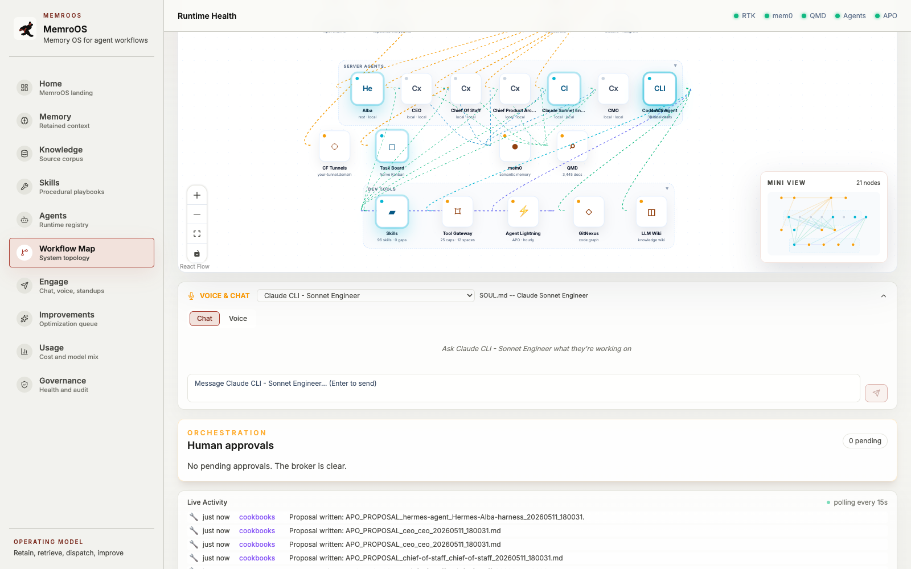
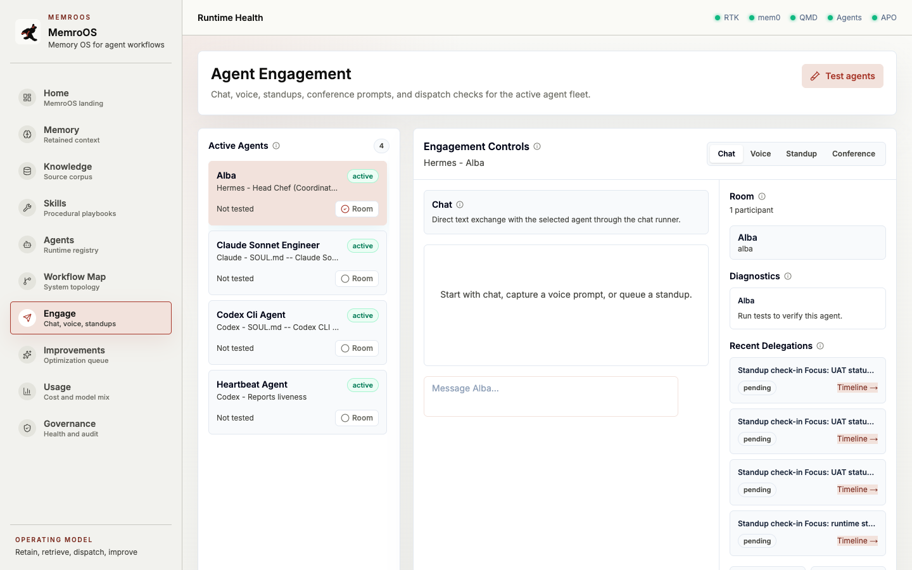
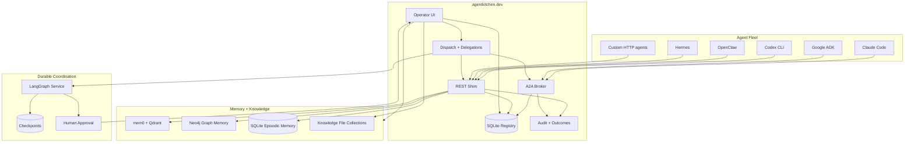
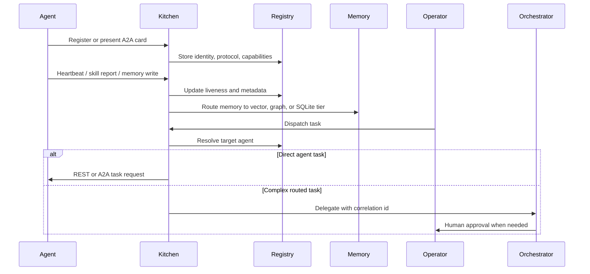
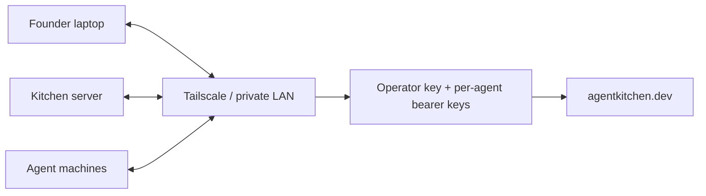
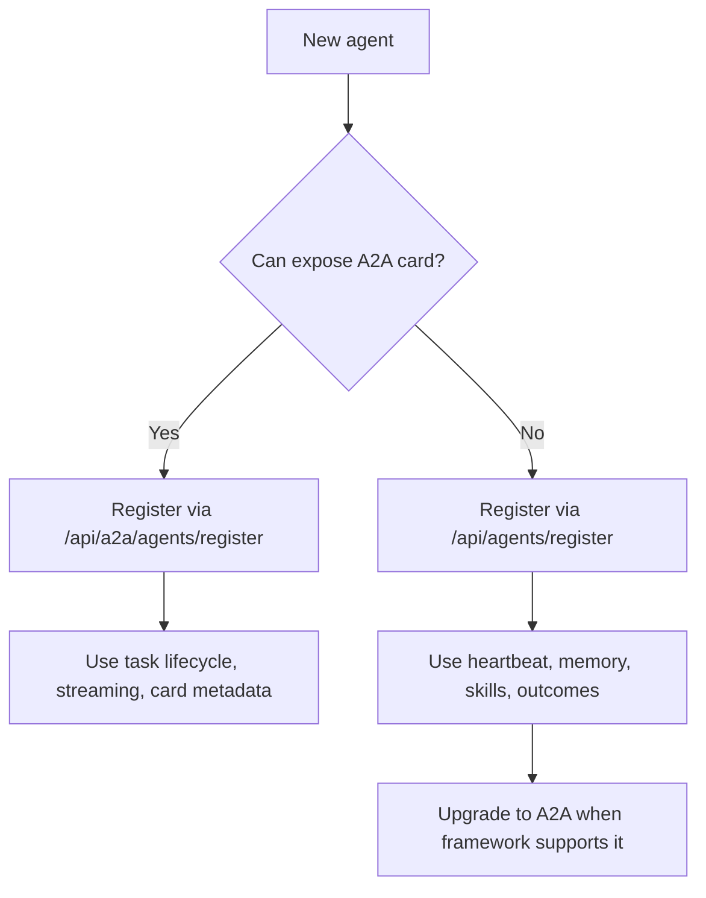
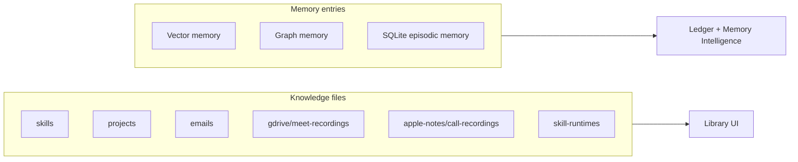

# agentkitchen.dev

<p align="center">
  <strong>The operator control plane for operating real multi-agent fleets.</strong>
</p>

<p align="center">
  Register agents, inspect liveness, dispatch work, broker A2A tasks, route memory, and keep a startup-sized agent society from becoming soup.
</p>

<p align="center">
  <a href="https://github.com/lac5q/agentkitchen.dev/blob/main/LICENSE"></a>
  
  
  
  
  
</p>

<p align="center">
  <a href="#demo">Demo</a> |
  <a href="#quickstart">Quickstart</a> |
  <a href="#why-star-this-repo">Why Star</a> |
  <a href="#architecture">Architecture</a> |
  <a href="#security-model">Security</a> |
  <a href="#upcoming-features">Upcoming</a> |
  <a href="#docs">Docs</a>
</p>

---

## Demo

agentkitchen.dev is a dashboard and API surface for the part of agent systems that usually lives in scattered terminal tabs, notebooks, cron logs, local databases, and half-remembered shell scripts.

<p align="center">
  
</p>

<p align="center">
  <em>The Flow map gives operators a live topology of agents, infrastructure, memory, skills, and task paths.</em>
</p>

<table>
  <tr>
    <td width="50%"></td>
    <td width="50%"></td>
  </tr>
  <tr>
    <td><strong>Dispatch</strong><br>Send tasks to registered agents and inspect live delegation state.</td>
    <td><strong>Library</strong><br>Track knowledge files, memory health, freshness gaps, and collection growth.</td>
  </tr>
  <tr>
    <td width="50%"></td>
    <td width="50%"></td>
  </tr>
  <tr>
    <td><strong>APO review</strong><br>Approve self-learning proposals before they modify skills or agent instructions.</td>
    <td><strong>Ledger</strong><br>Watch memory, recall, audit, and operational signals from one place.</td>
  </tr>
</table>

> Want a video? A short demo recording is planned. Until then, the screenshots above are captured from the live local app and represent the intended operator experience.

## Why Star This Repo

Star agentkitchen.dev if you are building agent systems that are moving from clever demos into daily operations.

- **You run more than one agent.** Claude Code, Codex, OpenClaw, Hermes, Google ADK, LangGraph, CrewAI, AutoGen, custom HTTP workers: Kitchen gives them one roster.
- **You care where agents live.** Local machine, VM, Tailscale host, Cloudflare tunnel, LAN box, cloud URL: the registry keeps location and reachability explicit.
- **You want standards without waiting for everyone.** A2A is the preferred path; REST shims keep non-A2A agents useful today.
- **You need memory boundaries.** Knowledge files, vector memory, graph memory, episodic memory, and audit logs are separated on purpose.
- **You want operator control.** Registry writes, destructive actions, and self-learning proposals are gated instead of casually automated.
- **You believe agents need infrastructure.** Not just prompts. Not just chat. A system of record.

## What You Can Do In 5 Minutes

After setup, you can:

1. Open the Kitchen UI.
2. Register a local or remote agent.
3. See it appear in the canonical registry.
4. Send heartbeats, memory writes, or skill reports through REST.
5. Ingest an A2A agent card and dispatch a task.
6. Inspect memory and knowledge health from the Library.
7. Review APO proposals before they modify skills.

## Release 0.1

`v0.1.0` is the first public operator preview of agentkitchen.dev.

This release is intentionally focused on the control-plane foundation:

- A Next.js operator console with the Flow, Registry, Dispatch, Library, Ledger, and Sous Vide surfaces.
- A canonical SQLite-backed agent registry for REST, UI, and A2A-visible agents.
- A2A card ingestion, task routes, streaming subscription endpoints, and Google ADK compatibility fixtures.
- REST reporting endpoints for heartbeats, memory writes, skill reports, and tool outcomes.
- Memory and knowledge visibility across configured file collections, mem0/Qdrant, graph memory, and Kitchen SQLite.
- Human-gated Agent Lightning/APO approvals so self-learning proposals queue before they mutate agent instructions.

The aim is not to pretend this is a polished SaaS. It is a useful, inspectable, hackable starting point for people operating multiple agents across real machines.

## What Kitchen Does

- **Canonical agent registry:** SQLite-backed roster for local, REST, UI, and A2A agents.
- **A2A broker:** Agent card discovery, JSON-RPC endpoints, task lifecycle routes, SSE task updates, and outbound A2A delegation.
- **REST shim:** Framework-agnostic endpoints for agents that do not speak A2A yet.
- **Dispatch:** Send work to registered agents and inspect live delegation history.
- **Flow map:** Visual system topology for agents, memory, skills, dispatch, and infrastructure.
- **Knowledge Library:** File counts, freshness alerts, collection maps, and growth trends for configured knowledge folders.
- **Memory routing:** Vector memory through mem0/Qdrant, graph memory through Neo4j, and episodic/audit memory in Kitchen SQLite.
- **Progressive capability discovery:** Tool-attention keeps optional systems such as GitNexus and Agent Lightning discoverable without loading every tool into every agent session.
- **APO review:** Approve self-learning skill improvement proposals before they are applied.
- **Operator security:** Operator-gated registry writes plus per-agent bearer keys for write/reporting endpoints.

## What Kitchen Is Not

- Not a replacement for Claude Code, Codex, OpenClaw, Hermes, Google ADK, LangGraph, CrewAI, or AutoGen.
- Not a hosted SaaS control plane.
- Not an excuse to expose your agents directly to the public internet.
- Not finished. It is useful, hackable, and moving fast.

Kitchen is the operating layer between frameworks.

## Architecture

Kitchen is intentionally thin at the boundary and durable at the center.



### Data Flow



## Quickstart

### Prerequisites

- Node.js and npm
- Python 3
- Docker with Docker Compose
- Optional: Qdrant Cloud URL and API key for vector memory
- Optional: Tailscale for multi-machine private networking

```bash
git clone https://github.com/lac5q/agentkitchen.dev.git
cd agentkitchen.dev
npm install
./setup.sh --wizard
./setup.sh
```

Previously shared GitHub links to `https://github.com/lac5q/agent-kitchen` should continue to resolve through GitHub's repository rename redirect. Use the new `agentkitchen.dev` URL for fresh links so this project is not confused with similarly named repositories.

Open Kitchen:

```text
http://localhost:3000
```

For a local production-style server:

```bash
npm --prefix apps/kitchen run build
KITCHEN_PUBLIC_BASE_URL=http://localhost:3002 \
KITCHEN_A2A_ENDPOINT_BASE_URL=http://localhost:3002 \
npm --prefix apps/kitchen run start -- --port 3002
```

## Recommended Deployment

Kitchen is designed to start private and become public only when you mean it.



Operating profiles:

- `local-dev`: one developer machine; loopback registry writes can work without an operator key.
- `single-host`: all services on one server or VM; operator key required.
- `private-network`: recommended startup deployment for multiple machines on Tailscale or LAN.
- `cloud-https`: internet-reachable deployment behind HTTPS reverse proxy or tunnel.
- `custom`: operator-defined topology with explicit environment values.

See [Install profiles](docs/install-profiles.md).

## Agent Registry

Kitchen has one canonical registry. The `/agents` page shows this DB-backed roster, not ad hoc files.

### Register a REST agent

```bash
curl -X POST http://localhost:3000/api/agents/register \
  -H 'Content-Type: application/json' \
  -H 'x-kitchen-operator-key: <operator-key>' \
  -d '{
    "id": "worker-1",
    "name": "Worker 1",
    "role": "Research and implementation agent",
    "platform": "codex",
    "protocol": "rest",
    "location": "tailscale",
    "host": "agent.tailnet",
    "port": 8787,
    "healthEndpoint": "/health"
  }'
```

### Register an A2A agent by card URL

```bash
curl -X POST http://localhost:3000/api/a2a/agents/register \
  -H 'Content-Type: application/json' \
  -H 'x-kitchen-operator-key: <operator-key>' \
  -d '{
    "cardUrl": "http://agent.tailnet:8000/.well-known/agent-card.json",
    "source": "a2a"
  }'
```

The response may include an API key unless `issueApiKey` is false. Store it securely. Kitchen never displays stored bearer tokens after creation.

### One-command agent onboarding

For agents that can run shell commands, create a short-lived invite and hand the returned command to the agent. The invite registers the agent, mints its per-agent API key, and returns an agentkitchen.dev MCP config.

```bash
curl -X POST http://localhost:3000/api/onboarding/invite \
  -H 'Content-Type: application/json' \
  -H 'x-kitchen-operator-key: <operator-key>' \
  -d '{
    "agentId": "maria",
    "name": "Maria",
    "role": "Research and implementation partner",
    "platform": "openclaw",
    "ttlMinutes": 15
  }'
```

Give the `command` from the response to the agent. The command looks like:

```bash
curl -fsSL 'https://kitchen.example/api/onboarding/script?token=...' | bash -s -- --id 'maria' --name 'Maria' --role 'Research and implementation partner' --platform 'openclaw' --mcp-target 'auto'
```

The default `--mcp-target auto` selects the right installer from the platform: `hermes`, `openclaw`, `claude`, `gemini`, `qwen`, `codex`, or `stdout` for `chatgpt`. The bootstrap prefers each runtime's own MCP command when available and falls back to narrow config writes, so newer runtime installers can keep working without changing the invite command. Use `--mcp-target file:/path/to/mcp.json`, `--mcp-target stdout`, or `AGENT_KITCHEN_MCP_TARGET=...` to override. ChatGPT cannot run the shell command directly; for ChatGPT, use the returned `mcpUrl` as the custom connector URL in ChatGPT Apps & Connectors.

If `/agents` shows fewer agents than expected, check:

- The agent has been registered into the canonical registry.
- Its host and port are real, not placeholders such as `100.x.x.x`.
- A2A agents expose a valid card URL.
- REST agents have a health endpoint if you want remote reachability.

## Protocol Strategy



Use **A2A** when the framework can expose or consume an agent card and task lifecycle. This is the preferred path for standards-compatible agents such as Google ADK services and future A2A-native runtimes.

Use **REST shim** when the framework does not speak A2A yet or when you only need reporting: heartbeat, memory writes, skill outcomes, and registry visibility.

## Memory and Knowledge

Kitchen keeps knowledge files and conversation memory separate on purpose.



The Library counts `.md`, `.mdx`, and `.txt` files from configured collections. A collection can combine multiple source folders; `meet-recordings` includes both Google Drive transcripts and exported Apple Notes call recordings. Memory entries live in separate memory services and SQLite tables, so a collection file count is not the same thing as total memories.

## Progressive Capabilities

agentkitchen.dev treats specialized systems as optional progressive capabilities. They can be checked during setup, shown in tool-attention, and recommended from outcome history without becoming required dependencies for every install.

Enable the current optional bundle with:

```env
KITCHEN_OPTIONAL_CAPABILITIES=gitnexus,agent-lightning
```

Current bundled capabilities:

- **GitNexus:** Kept as a separate MCP server, exposed through `.mcp.json` as `mcp-server:gitnexus`. agentkitchen.dev does not proxy or replace GitNexus; it catalogs the capability, reports status, and helps agents decide when to load it for code intelligence, impact analysis, and index health.
- **Agent Lightning/APO:** Exposed in tool-attention as `capability:agent-lightning`. Kitchen owns the operator UI/API approval queue, while the worker CLI applies approved proposals and archives them for audit history.

This separation keeps each system's lifecycle clear: GitNexus owns code graphs and indexes, Agent Lightning owns self-learning proposal workflows, and Kitchen owns discovery, operator control, memory routing, and outcome signals.

## Agent Lightning Approvals

Sous Vide approvals are intentionally two-step:

1. The UI/API approval moves the proposal into a durable `approved/` work queue.
2. The worker CLI applies queued approvals and archives the proposal for audit history.

Qwen is the default executor assignment for this queue:

```bash
npm --prefix apps/kitchen run apo:worker -- --executor qwen
```

Use `APO_APPROVAL_CLI=qwen` to keep that default for scheduled runs, or pass `--executor codex` / `--executor claude` when you explicitly want a different CLI to own the implementation pass.

## Security Model

Kitchen is built for private-network production first.

- Registry writes require `KITCHEN_OPERATOR_API_KEY` outside local loopback.
- Agent write/reporting endpoints require per-agent bearer credentials minted by the registry.
- Memory read endpoints require operator authorization because they can expose sensitive context.
- Prefer Tailscale or a private LAN for multi-machine startup deployments.
- Use HTTPS and explicit operator keys for public or tunnel exposure.
- Treat agent cards as untrusted input. Kitchen validates URL policy, payload size, required fields, and registration authorization.

## Local URLs

- Dashboard: `http://localhost:3000`
- Production-style local server: `http://localhost:3002`
- Registry UI: `/agents`
- Dispatch UI: `/dispatch`
- Flow UI: `/flow`
- Library UI: `/library`
- A2A card: `/.well-known/agent-card.json`

## Development

```bash
npm run dev
npm run test
npm run lint
npm run build
npm run profiles:check
npm run first-run:check
```

## Project Structure

```text
agentkitchen.dev/
├── apps/kitchen/              # Next.js UI and API routes
├── services/orchestration/    # Python LangGraph orchestration service
├── services/memory/           # mem0 service wrapper
├── services/knowledge-mcp/    # Knowledge/tool-attention MCP facade
├── services/voice-server/     # Optional voice service
├── config/                    # Operating profiles
├── docker/                    # Service Dockerfiles
├── docs/                      # User and architecture docs
├── scripts/                   # Setup and validation scripts
└── data/                      # Local SQLite state, gitignored
```

## Docs

- [Architecture](docs/architecture.md)
- [Install profiles](docs/install-profiles.md)
- [REST API reference](docs/rest-api.md)
- [Memory architecture](docs/memory-architecture.md)
- [Claude Code integration](docs/integrations/claude-code.md)
- [Google ADK integration](docs/integrations/google-adk.md)
- [LangGraph integration](docs/integrations/langgraph.md)
- [agentkitchen.dev MCP server](docs/integrations/mcp.md)
- [CrewAI and AutoGen integration](docs/integrations/crewai-autogen.md)

## Upcoming Features

Near-term focus after `v0.1.0`:

- More A2A compatibility fixtures and interop tests.
- Cleaner first-run onboarding for non-localhost deployments.
- Better demo recording and hosted screenshot gallery.
- More adapters for popular agent runtimes.
- Hardened production profile examples for Tailscale, Docker, and HTTPS reverse proxies.

ClaudeClaw-inspired operator surfaces:

- **Chat tab:** A dedicated command/chat workspace for speaking with CLIs, Paperclip project agents, runtime subagents, and the Kitchen system without burying chat inside the Flow page.
- **Memory search:** First-class search across episodic SQLite recall, mem0/vector memory, graph memory, and knowledge files, with filters for agent, project, source, date, and memory tier.
- **Schedules and routines:** A visible routines console for cron jobs, recurring agent checks, standing delegations, maintenance tasks, and approval-required automations.
- **Hivemind Obsidian view:** An Obsidian-inspired graph/canvas view of agents, memories, tasks, proposals, skills, and backlinks so operators can browse the agent society as a living knowledge map.
- **Design-system completion:** Finish the Paperclip-style visual migration across drawers, sheets, modals, detail panels, empty states, and error states so no screen falls back to the older dark dashboard shell.
- **Flow canvas redesign:** Bring the React Flow topology, minimap, controls, node cards, edge styling, and node detail panels into the new Paperclip-style system while preserving graph readability.

## Contributing

This project is early, but useful contributions are very welcome.

Good first contribution areas:

- Add an adapter for an agent framework you use.
- Improve setup docs for your deployment shape.
- Add screenshots or recordings from a real multi-machine setup.
- Add A2A compatibility fixtures.
- Improve security tests around registry writes and memory reads.

If agentkitchen.dev helps you run more than one agent without losing the plot, please star the repo. It helps the project find the people building the same weird, useful future.

## License

MIT. See [LICENSE](LICENSE).
