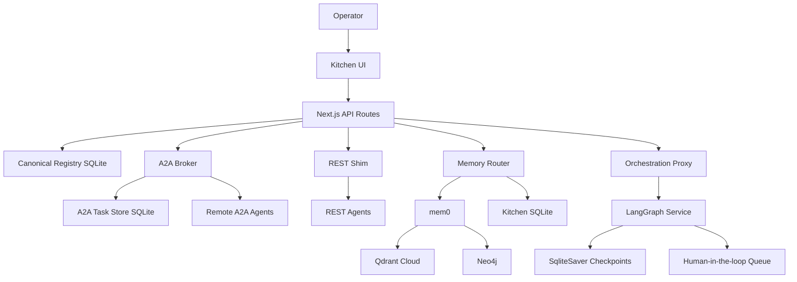

# agentkitchen.dev Architecture

agentkitchen.dev is a thin, durable broker and observability layer for agent systems. It does not try to become every framework's runtime. Instead, it standardizes registration, authentication, task transport, memory reporting, and operator visibility.

## System Shape

## Core Components

### Kitchen UI

The UI is the operator surface: registry, Flow, memory intelligence, dispatch, ledger, library, notebooks, cookbooks, and APO. It should stay useful even when optional services are degraded.

### Canonical Registry

The registry is the source of truth for connected agents. It stores identity, protocol, platform, network coordinates, capabilities, heartbeats, generated API keys, memory writes, and skill reports.

Legacy `agents.config.json` entries are not automatically canonical registry entries. They are older remote polling config and should be migrated by registering agents into the DB-backed registry.

### A2A Broker

The A2A broker exposes:

- `/.well-known/agent-card.json`
- `/.well-known/agent.json`
- `/a2a`
- `/message:send`
- `/message:stream`
- `/tasks`
- `/tasks/{id}`
- `/tasks/{id}:cancel`
- `/tasks/{id}:subscribe`

Kitchen keeps the broker durable and boring: authenticate, validate, store task state, expose SSE updates, and delegate outward when needed. More intelligent routing belongs in the orchestration service.

### REST Shim

The REST shim lets non-A2A frameworks integrate quickly. Agents can report heartbeats, memory writes, and skill usage with a bearer key issued by Kitchen.

### Memory Router

Memory has three tiers:

- Vector: semantic recall through mem0 backed by Qdrant Cloud.
- Graph: relationship queries through mem0 backed by Neo4j.
- Episodic: operational memory and audit rows in Kitchen SQLite.

### LangGraph Orchestration Service

Kitchen delegates multi-step routed tasks to the Python orchestration service. The service owns LangGraph graphs, checkpointing, retry metadata, and human approval state. Kitchen remains the UI/proxy boundary.

## Deployment Boundaries

Recommended startup deployment:

- Kitchen runs on one host.
- Agents run on one or more machines.
- Machines communicate over Tailscale or a trusted LAN.
- `KITCHEN_OPERATOR_API_KEY` protects operator writes.
- Agents use per-agent bearer keys for runtime writes.

Cloud deployment:

- Put Kitchen behind HTTPS.
- Require operator key.
- Use real secrets management.
- Restrict A2A card ingestion to approved card URLs and networks.

## Data Stores

| Store | Owner | Purpose |
| --- | --- | --- |
| SQLite `data/conversations.db` | Kitchen | Registry, A2A tasks, reports, audit, episodic memory |
| Qdrant Cloud | mem0 | Vector memory |
| Neo4j | mem0 / Kitchen graph routes | Graph memory |
| Orchestration SQLite | LangGraph service | Checkpoints and HIL state |

## Design Choices

- **Thin broker over smart monolith:** Kitchen coordinates and observes; it does not replace agent frameworks.
- **A2A first, REST compatible:** Prefer standards where they exist, keep a pragmatic shim for frameworks still catching up.
- **Private network first:** Multi-machine startup deployments should start on Tailscale/LAN before public exposure.
- **Explicit registration:** Agents become canonical only after registry registration or A2A card ingestion.
