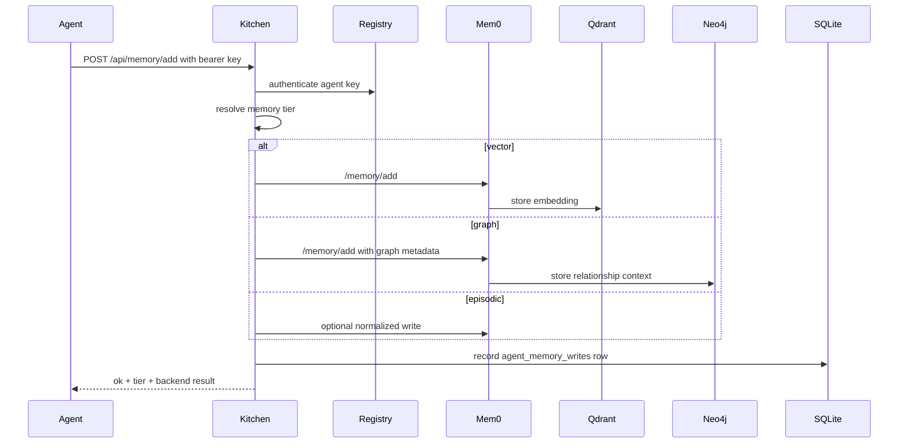

# Memory Architecture

agentkitchen.dev uses three memory tiers so agents can store the right kind of knowledge in the right backend.

## Tiers

| Tier | Backend | Best for | Route |
| --- | --- | --- | --- |
| Vector | mem0 + Qdrant Cloud | Semantic recall, similar situations, fuzzy knowledge | `/api/memory/add`, `/api/memory/search` |
| Graph | mem0 + Neo4j | People, agents, entities, relationships, dependencies | `/api/memory/add`, `/api/memory/graph` |
| Episodic | Kitchen SQLite | Operational events, reports, audit-like memory writes | `/api/memory/add`, `/api/memory/health` |

## Write Path



## Routing Rules

Agents may specify a tier directly:

```json
{
  "content": "Worker 1 learned that private-network is the preferred startup deployment.",
  "tier": "vector",
  "metadata": { "topic": "deployment" }
}
```

Use:

- `vector` for facts that should be recalled by meaning.
- `graph` for relationships between people, agents, repos, tasks, services, or dependencies.
- `episodic` for event-like records where timestamp and provenance matter most.

If no tier is supplied, Kitchen normalizes metadata and chooses the safest default for the current payload.

## Progressive Capability Boundaries

Tool-attention and memory are related, but they are not the same store.

- Progressive capability catalog entries describe which tools and systems are available, such as `mcp-server:gitnexus` or `capability:agent-lightning`.
- Tool-attention outcomes record whether a capability helped or failed for a task type.
- Memory stores compact durable lessons and preferences derived from use.

Do not store generated GitNexus code graphs, full impact reports, APO proposal bodies, approved skill patches, or raw tool outputs in memory. Those belong in their source systems: GitNexus indexes, APO proposal folders, audit logs, or source control.

Good memory examples:

- "GitNexus helped with impact analysis for agent-kitchen refactors."
- "Agent Lightning approval workflow is preferred for recurring skill fixes."

Bad memory examples:

- Full GitNexus symbol graphs or process traces.
- Full APO proposal markdown.
- Full skill patch contents.

## Read Path

- `/api/memory/search` reads vector memory.
- `/api/memory/graph` reads graph memory.
- `/api/memory/health` checks vector, graph, and episodic health.

All memory read endpoints require operator authorization because memory can contain sensitive strategy, credentials-adjacent operational context, or personal data.

## Neo4j Schema Guidance

Kitchen does not force one global ontology yet. Use a small, stable vocabulary:

- `(:Agent {id, name, platform})`
- `(:Person {name})`
- `(:Project {name})`
- `(:Task {id, summary})`
- `(:Capability {id, name})`
- `(:Service {name, url})`

Suggested relationships:

- `(Agent)-[:HAS_CAPABILITY]->(Capability)`
- `(Agent)-[:WORKED_ON]->(Task)`
- `(Task)-[:PART_OF]->(Project)`
- `(Agent)-[:REPORTS_TO]->(Agent)`
- `(Service)-[:DEPENDS_ON]->(Service)`
- `(Person)-[:OWNS]->(Project)`

Prefer stable IDs in metadata so graph writes can be deduplicated later.

## Operational Checks

```bash
curl -H 'x-kitchen-operator-key: <operator-key>' \
  'http://localhost:3000/api/memory/health'
```

Healthy deployments should show:

- Vector tier up when mem0 and Qdrant Cloud are reachable.
- Graph tier up when Neo4j is reachable.
- Episodic tier up when Kitchen SQLite is writable.

## Privacy Notes

- Do not write raw secrets to any memory tier.
- Use metadata to store provenance and classification.
- Treat graph memory as sensitive because relationship data can reveal strategy or personal context.
- Prefer operator-authenticated reads only; do not expose memory read routes publicly.
